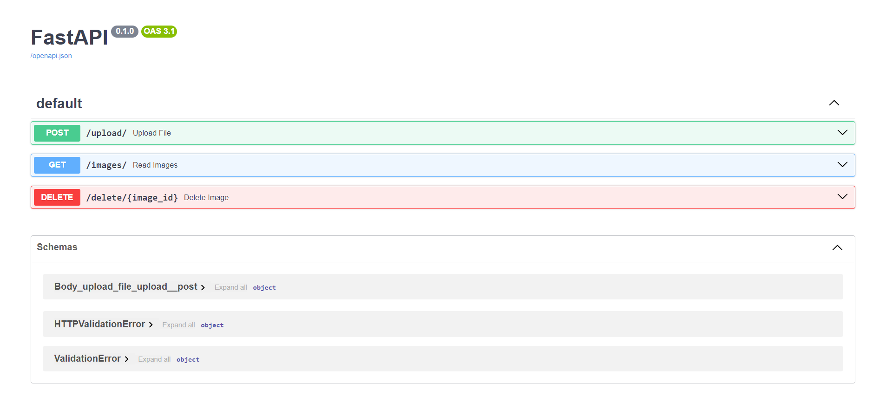
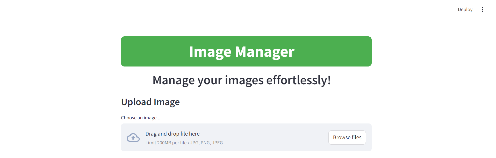
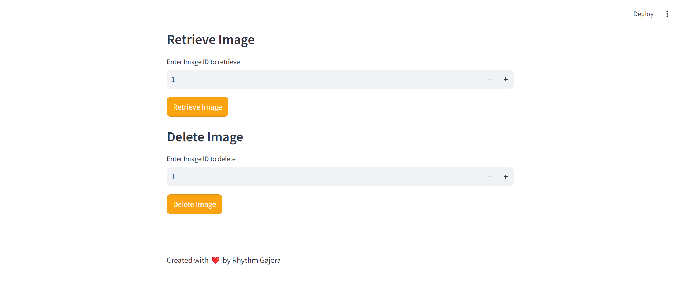
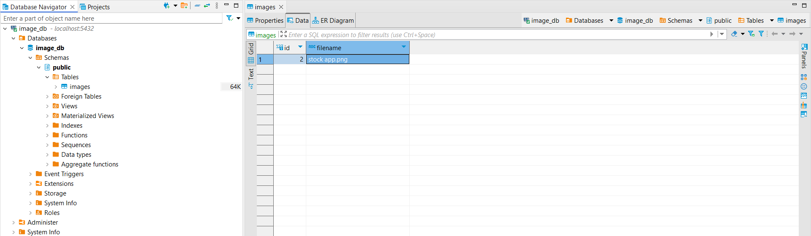

# Image_Management
Image Manager simplifies image management with FastAPI and Streamlit. Upload, retrieve by ID, and delete images seamlessly. AWS S3 ensures secure storage, while PostgreSQL manages data efficiently. Ideal for developers and content managers seeking streamlined image asset organization and accessibility.

